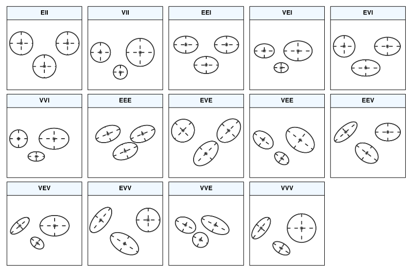

```{r}
knitr::opts_chunk$set(message= FALSE, warning = FALSE)
```

```{r}
library(tidyverse)  # data manipulation
library(cluster) #clustering
library(factoextra) # clustering algorithms & visualization
library(gridExtra) # multiple plotting with ggplot2
library(mclust) # clustering with mixture model

PATH= '/home/ivanobat/gitrepos/StatModInf/seminar4'
```

In this seminar, we will implement K-means and Gaussian mixture models on two different datasets.

# K-means

We will implement K-means on the US Arrest data. This data set contains statistics, in arrests per 100,000 residents, for assault, murder, and rape in each of the 50 US states in 1973.

```{r}
df <- USArrests    # load the arrests data 
df <- na.omit(df)  # drop missings 
df <- scale(df)    # rescale
dim(df)
head(df)
```


## K-means from scratch

We build our own implementation of the k-means algorithm from scratch.

```{r}
# basic K-means clustering function 
km.fromscratch <- function(X, k){
  p <- ncol(X)  # number of parameters
  n <- nrow(X)  # number of observations
  iter <- 0 
  
  # Stopping criteria  
  Delta <- 1 # Euclidean distance between successive values of the centroid vectors
  Delta_min <- 1e-4 # tolerance for Delta
  itermax <- 30 # maximum number of iteration
  
  while(Delta > Delta_min && iter <= itermax){
    
    # initialization (will be run only once)
    if(iter == 0){
      centroid <- X[sample(nrow(X), k),]    # initialize using a random initialization (e.g. selecting k out of n points)
      centroid_mem <- centroid
    }
    
    ### Assignment step
    
    d <- sapply(1:k, function(c) sapply(1:n, 
      function(i) sum((centroid[c,] - X[i,])^2) ))
    
    # Assign each observation to the closest centroid  
    cluster <- apply(d, 1, which.min)      
    
    ### Update center step
    
    # Compute the mean of the observations currently assigned to a cluster c
    cluster_centroid <- function(c){
      if(sum(cluster==c)>1){ #if cluster has more than one observation
        cent = apply(X[cluster == c,], 2, mean)
      } else {
        cent = X[cluster == c,]  #if cluster has only one observation
      }
      return(cent)
    }
    
    # Compute all the current cluster centroids
    centroid <- t(sapply(1:k, cluster_centroid))    
    
    ### Update values to assess stopping criteria
    Delta <- sum((centroid - centroid_mem)^2)    
    iter <- iter + 1
    centroid_mem <- centroid   
  }
  return(list(centroid = centroid, cluster = cluster, data = X))
}

set.seed(1)
km_scratch_2 <- km.fromscratch(df, k=2)

print(cbind(rownames(df),km_scratch_2$cluster))   # print cluster assignment  
print(km_scratch_2$centroid)  # print mean clusters 

```

Clustering belongs to unsupervised learning, we do not have outcomes (here group labels) to check our assignments. We do not know the true number of groups and we can run k-means for different values of $k$.

```{r}
set.seed(10)
km_scratch_2 <- km.fromscratch(df, k=2)
km_scratch_3 <- km.fromscratch(df, k=3)
km_scratch_4 <- km.fromscratch(df, k=4)
km_scratch_5 <- km.fromscratch(df, k=5)
km_scratch_res <- cbind(rownames(df),
            km_scratch_2$cluster,
            km_scratch_3$cluster,
            km_scratch_4$cluster,
            km_scratch_5$cluster)
colnames(km_scratch_res) <- c('State', '2_clusters','3_clusters',
                              '4_clusters','5_clusters')
km_scratch_res
```

Watch out! You may note that the assignments changed between the first and second times we ran k-means with $k=2$. The assignments are actually the same (or almost), but the labels '1' and '2' were switched. When you compare two clustering results or to true labels that is something you need to consider.

## K-means with bulit-in functions

R has a built-in function for k-means: `kmeans` where you can set the number of clusters with the argument `centers`, the maximum number of iterations with `iter.max` (default 10). R `kmeans` lets us use several random starting points for initialization, the number of random starts is set with argument `nstart`.

```{r}
k2 <- kmeans(df, centers = 2, nstart = 25)
k3 <- kmeans(df, centers = 3, nstart = 25)
k4 <- kmeans(df, centers = 4, nstart = 25)
k5 <- kmeans(df, centers = 5, nstart = 25)
```

You can use the function `fviz_cluster` to get a nice visualization of clustering results. Observations are plotted in a 2-dimensional representation obtained by PCA and painted by cluster, a convex hull is built around each cluster.

```{r}
fviz_cluster(k2, data = df)
```

Note that you can use `fviz_cluster` with outputs from some pre-defined clustering functions (e.g `kmeans` in `stats` package, `dbscan` in `fpc`, `Mclust` in `mclust`) but also any function that you write as long as it outputs a list object with data and cluster components (e.g.: list(data = mydata, cluster = myclust)). We can use `fviz_cluster` with the output of our `km.fromscratch` function.

```{r}
fviz_cluster(km_scratch_2)
```

It is built on top of `ggplot2` so you can use its syntax and extensions such as `gridExtra`.

```{r}
# plots to compare
p1 <- fviz_cluster(k2, geom = "point", data = df) + ggtitle("k = 2")
p2 <- fviz_cluster(k3, geom = "point",  data = df) + ggtitle("k = 3")
p3 <- fviz_cluster(k4, geom = "point",  data = df) + ggtitle("k = 4")
p4 <- fviz_cluster(k5, geom = "point",  data = df) + ggtitle("k = 5")

grid.arrange(p1, p2, p3, p4, nrow = 2)
```

## Clustering performance metrics

We compute the total within-cluster sum of squares to get an Elbow plot.

```{r}
# function to compute total within-cluster sum of square 
wss <- function(k) {
  kmeans(df, k, nstart = 10)$tot.withinss
}

# Compute and plot wss for k = 1 to k = 15
k.values <- 1:15

# extract wss for 2-15 clusters
wss_values <- map_dbl(k.values, wss)

wss_df <- data.frame(k=k.values, wss= wss_values)
ggplot(wss_df, aes(x=k,y=wss)) + 
  geom_point() +
  geom_line() +
  xlab("Number of clusters K") +
  ylab("Total within-clusters sum of squares")
```

What is a reasonable number of clusters according to the Elbow method?

```{css}
4


```

The function `clusGap` from the package `cluster` computes the gap statistic for any clustering function that takes as first argument a data matrix, as second argument the number of clusters, and returns a list object with a component named cluster (a vector of length n = nrow(matrix) of integers in 1:k). We can use `clusGap` with both the built-in function `kmeans` or our `km.fromscratch`. The argument `K.max` controls the maximum number of clusters to consider, `B` the number of bootstrap samples.

```{r}
# compute gap statistic
gap_stat <- clusGap(df, FUN = kmeans, nstart = 25, K.max = 10, B = 25) 

#gap_stat_kmeans_fromscratch <- clusGap(df, FUN = km.fromscratch, K.max = 10, B = 10) 

# Print the result
print(gap_stat, method = "firstmax")

# plot the gap 
fviz_gap_stat(gap_stat)
```
What is a reasonable number of clusters according to the gap statistic?

```{css}
??


```


# EM Gaussian mixture models 

We will fit a Gaussian mixture model on the wine data from package `gclus`. This dataset gathers 13 measurements from a chemical analysis of 178 Italian wines from three different cultivars: Barolo, Grignolinoa, and Barbera.

```{r}
# load the wine data 
data(wine, package = "gclus")
wine <- wine[sample(1:nrow(wine),nrow(wine)),]
Class <- factor(wine$Class, levels = 1:3, labels = c("Barolo", "Grignolino", "Barbera"))
X <- data.matrix(wine[,-1])
head(X)
```


## EM Gaussian mixture model from scratch

We build our own function to fit a Gaussian mixture model by EM-algorithm.

We first build the following helper functions:

```{r}
# Function to get the inverse of a covariance matrix Sigma
mvnorm.cov.inv <- function(Sigma) {
  # Eigendecomposition of covariance matrix
  E <- eigen(Sigma)
  Lambda.inv <- diag(E$values^-1)   # diagonal matrix
  Q <- E$vectors
  return(Q %*% Lambda.inv %*% t(Q))
}

# multivariate Gaussian pdf
mvn.pdf.i <- function(xi, mu, Sigma)
  1/sqrt( (2*pi)^length(xi) * det(Sigma) ) * 
  exp(-(1/2) * t(xi - mu) %*% mvnorm.cov.inv(Sigma) 
  %*% (xi - mu)  )

# likelihood of multivariate Gaussian on a sample X
mvn.pdf <- function(X, mu, Sigma)
  apply(X, 1, function(xi) mvn.pdf.i(as.numeric(xi), mu, Sigma))
```

We now build our EM Gaussian mixture function.

```{r}
##EM algorithm with multivariate normal distribution to estimate cluster probability
gmm.fromscratch <- function(X, k){
  p <- ncol(X)  # number of parameters
  n <- nrow(X)  # number of observations
  iter <- 0 
  
  # Stopping criteria  
  Delta <- 1 # Euclidean distance between successive values of the mean vectors
  Delta_min <- 1e-4 # tolerance for Delta
  itermax <- 100 # maximum number of iteration
  cat(paste('iteration: '))
  while(Delta > Delta_min && iter <= itermax){
    cat(paste0(iter,', '))
    ### initialization
    
    if(iter == 0){
      # we initialize the Gaussian component means to the k-means centroids 
      km.init <- km.fromscratch(X, k)
      mu <- km.init$centroid 
      mu_mem <- mu 
      
      # we initialize the Gaussian components covariance matrices to sample covariance
      # matrices of the k-means clusters of observations
      cov <- array(dim = c(p, p, k))
      for(i in 1:p) 
        for(j in 1:p) 
          for(c in 1:k) 
            cov[i, j, c] <- 1/n * sum((X[km.init$cluster == c, i] - mu[c, i]) * 
                                        (X[km.init$cluster == c, j] - mu[c, j]))
      
      # we initialize the mixing proportions (pi in our notation) to the proportions
      # derived from k-means clusters
      w <- sapply(1:k, function(i) length(which(km.init$cluster == i)))
      w <- w/sum(w)
    }
    
    
    ### E-step
    
    # We compute the posterior probabilities (gamma_ik in our notation)
    mvn.c <- sapply(1:k, function(c) mvn.pdf(X, mu[c,], cov[,, c]))
    r_ic <- t(w*t(mvn.c)) / rowSums(t(w*t(mvn.c)))
    
    
    ### M-step
    
    # We compute the "effective" number of observations by component
    n_c <- colSums(r_ic)
    # We update the mixing proportions (pi in our notation)
    w <- n_c/sum(n_c)
    # We update the Gaussian component means
    mu <- t(sapply(1:k, function(c) 1/n_c[c] * colSums(r_ic[, c] *
      X)))
    # We update the Gaussian component covariance matrices
    for(i in 1:p) 
      for(j in 1:p) 
        for(c in 1:k) 
          cov[i, j, c] <- 1/n_c[c] * sum(r_ic[, c] * (X[, i] - mu[c, i]) * 
                                           r_ic[, c] * (X[, j] - mu[c, j]))
    
    ### Update on values to assess stopping criteria
    
    Delta <- sum((mu - mu_mem)^2)
    iter <- iter + 1
    mu_mem <- mu
  }
  if(iter < itermax){
    cat(paste('converged at iteration',iter,'\n'))
  } else {
    cat('max number of iterations attained')
  }
  
  #We assign the observation to cluster with largest posterior probability
  hard_cluster = apply(r_ic, 1,which.max) 
  
  return(list(softcluster = r_ic, 
              cluster = hard_cluster,
              data = X))
}

gmm <- gmm.fromscratch(X , k=3)
gmm_res <- data.frame(cultivar = Class, cluster= gmm$cluster)
head(gmm_res,20)  # print cluster assignment based on highest probability 
```

In this toy example, we have the ground truth so we can cross tabulate our cluster assignments with the true labels.

```{r}
with(gmm_res,table(cultivar,cluster))
```
How did our GMM perform?

```{css}
#write your answer here


```


## EM Gaussian mixture model with bulit-in functions

The `mclust` package offers clustering based on Gaussian mixture models through the function `Mclust`. `Mclust` fits a Gaussian mixture model by EM algorithm for different values of the number of clusters (argument `G`, defaults to 1 to 9) and different constraints on the covariance matrices of the Gaussian components. 

Recall, confidence regions for a multivariate Gaussian are ellipsoids. Similarly in a Gaussian mixture model the clusters are ellipsoidal, centered at the mean vector $\mu_k$, and with other geometric features that depend on the covariance matrices of the Gaussian components.

We can decompose a covariance matrix $\Sigma_{k}$ by eigen-decompostion and we can write:
$$\Sigma_{k}=\lambda_{k} S_{k} D_{k} S_{k}^{T}$$
where $\lambda_{k}$ is a scalar controlling the volume of the ellipsoid, $D_{k}$ is a diagonal matrix specifying the shape of the density contours with $\operatorname{det}\left(D_{k}\right)=1$, and $S_{k}$ is an orthogonal matrix which determines the orientation of the corresponding ellipsoid.

`Mclust` fits different GMMs with different constraints on the $\Sigma_k$, such as: equal volume, equal shape, equal orientation, spherical (uncorrelated variables)... and different numbers of components. The function picks the best model (type of GMM and number of components) using the BIC criterion. You can learn more about the different types of GMM it fits with `help(mclustModelNames)` and reading the documentation.

Here is an overview of the different types of GMM considered in `Mclust`:
```{r, echo=FALSE, out.width = '50%'}

```


We run the `Mclust` function on our wine data.

```{r}
mod <- Mclust(X)
```

The best BIC values where obtained for the following models: VVE-3 (3 ellipsoidal components with equal orientation), EVE-4 (4 ellipsoidal components with equal volume and orientation) and VVE-4 (4 ellipsoidal components with equal orientation).

```{r}
summary(mod$BIC)
```

We can plot the BIC values for the different types of GMM as a function of the number of components/clusters:

```{r}
plot(mod, what = "BIC", ylim = range(mod$BIC[,-(1:2)], na.rm = TRUE),
     legendArgs = list(x = "bottomleft"))
```

The summary function gives us the winning model, the clustering output and some statistics.

```{r}
summary(mod)
```
We cross tabulate our cluster assignments with the true labels.

```{r}
table(Class, mod$classification)
```

How did our GMM perform?

```{css}
#write your answer here


```


Note that we can force `Mclust` to fit a GMM with 3 clusters and no constraint on the covariance matrices, which would be the closest option to our EM algorithm above.

```{r}
mod_3_VVV <- Mclust(X, G=c(3), modelNames = c('VVV'))
```

# Homework

Theory: Solve exercises 4 and 5 of the second set of problems.

Pratice:

This is a real business dataset from a large e-commerce company. The company has a global and diverse infrastructure which causes many identical products to be classified differently. To conduct sound and insightful product analysis, the company needs to be able to accurately cluster similar products. The dataset has 93 features for 10,000 products and your objective is to cluster the products in coherent groups. You will implement different clustering algorithms, at least one hard clustering and one soft clustering and compare your results. You are working in an unsupervised setting so you do not know the true number of groups and will have to use different statistics to pick an optimal number of groups.

Optional: on the day of the deadline, the true labels / classes will be released and you will be able to compare your clustering to the ground truth.

Submit your analysis and code in R markdown format, hand in both the .Rmd file and the knitted Rmd. Please submit one zip file on Classroom that gathers all the files you submit.

```{r}
library(readr)
product_features <- read_csv(file.path(PATH,"product_features.csv"))
```

